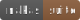

# Nakas Cookies

[](https://github.com/IkramMbz/nakas-cookies/blob/main/README.md#installation) [](https://mbechezi.fr/#nakas-suite) [](https://github.com/IkramMbz/nakas-cookies/blob/main/LICENSE) [](https://nodejs.org/) [](https://www.typescriptlang.org/) [](https://nextjs.org/) [](https://reactjs.org/)

**Nakas Cookies** is a lightweight React library to simplify the implementation, collection, and management of cookie consent in your applications.

🟤**Note:** Nakas Cookies is currently in the testing phase and is not yet available on npm. It will be released soon.

## Table of Contents
- [Key Features](#key-features)
- [Installation](#installation)
- [Usage](#usage)
- [Contributing](#contributing)
- [License](#license)

## Key Features
- Simplifies cookie consent collection and management
- Reusable and modular React components
- Built with TypeScript for full type safety
- Lightweight and easy to integrate
- Code quality ensured with ESLint & Prettier

## Installation

To use Nakas Cookies in your project, your environment must meet the following minimum requirements:

- **Node.js** ≥ 18 (for full ESM support and modern module resolution)  
- **Package Manager:** `pnpm` ≥ 7 (or `npm` / `yarn`, scripts are tested with pnpm)

Initialize your project if you haven't already:

```bash
npm init -y
```

Then install the library directly from GitHub (since it's not yet published on npm):
```bash
npm install https://github.com/IkramMbz/nakas-cookies
```

## Usage

Import components into your React/Next project like:

```tsx
import CookiesConsentModal from "nakas-cookies";

export default function App() {
    return (
        <CookiesConsentModal appPrefix="myApp">
            <button>Open Cookie Preferences</button>
        </CookiesConsentModal>
    );
}
```

## Contributing

Components and features are actively developed and may change. Community contributions will be welcomed in the future.

## License

Nakas Cookies is licensed under the [MIT License](https://github.com/IkramMbz/nakas-cookies/blob/main/LICENSE).